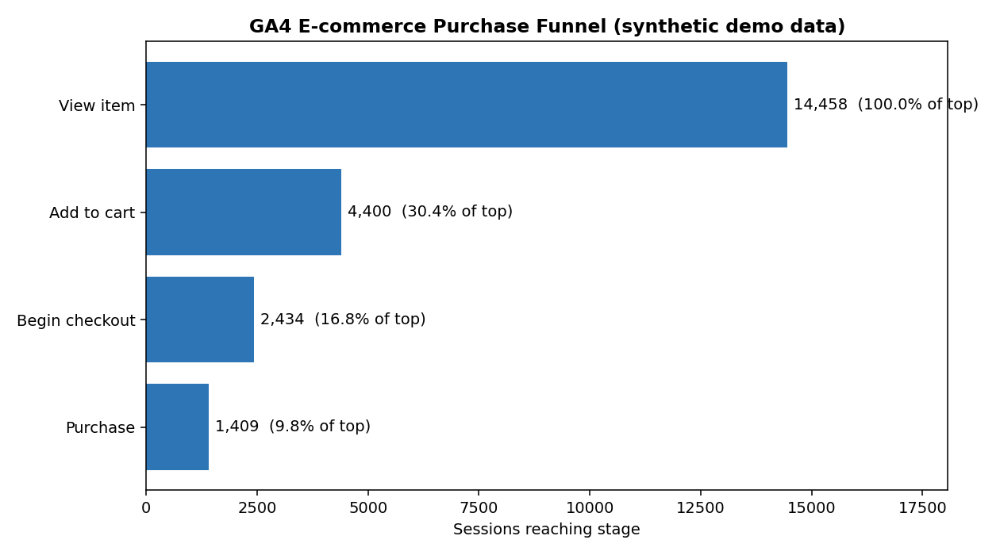

# GA4 E-commerce Funnel Analysis (SQL · BigQuery)

Analyzing the purchase funnel of an online store using **SQL** on Google Analytics 4
event data — from product view through add-to-cart, checkout, and purchase — to find
where shoppers drop off and which segments convert best.

**Dataset:** [`bigquery-public-data.ga4_obfuscated_sample_ecommerce`](https://developers.google.com/analytics/bigquery/web-ecommerce-demo-dataset)
— Google Analytics 4 sample export from the Google Merchandise Store (Nov 2020 – Jan 2021), free and public in BigQuery.

---

## Business questions

1. How many sessions reach each stage of the purchase funnel, and where is the biggest drop-off?
2. What are the step-to-step and overall conversion rates?
3. Does conversion differ by **device** (desktop vs. mobile vs. tablet)?
4. Which **acquisition sources** bring the most traffic, and how well does each convert?
5. Which **products** are added to cart most, and how often do those adds turn into purchases (cart abandonment)?

## The funnel

```
view_item  →  add_to_cart  →  begin_checkout  →  purchase
```

A "session" is defined as a unique `user_pseudo_id` + `ga_session_id`. A session counts
toward a stage if it fired that event at least once.

## How GA4 data is shaped (and why the SQL looks like this)

GA4 exports are **event-based**: one row per event, with details tucked inside nested/repeated
fields. The queries here lean on three techniques an analyst needs for GA4:

- **`UNNEST(event_params)`** to pull scalar values (like `ga_session_id`) out of a repeated `STRUCT` array.
- **Conditional aggregation** (`MAX(IF(event_name = 'add_to_cart', 1, 0))`) to collapse many event rows into one row per session with a flag for each stage.
- **Wildcard tables + `_TABLE_SUFFIX`** to scan a date range of daily `events_YYYYMMDD` tables in one query.

## Repository structure

```
ga4-ecommerce-funnel/
├── README.md
├── sql/
│   ├── 01_daily_overview.sql              # daily active users + event volumes
│   ├── 02_funnel_counts.sql               # sessions reaching each stage
│   ├── 03_funnel_conversion_rates.sql     # step + overall conversion rates
│   ├── 04_funnel_by_device.sql            # funnel split by device category
│   ├── 05_funnel_by_traffic_source.sql    # volume + conversion by source/medium
│   └── 06_top_products_add_vs_purchase.sql# cart abandonment by product
├── analysis/
│   └── funnel_demo.py                     # runnable demo (DuckDB, synthetic data)
├── data/                                  # demo output (CSV)
├── images/
│   └── funnel_chart.png                   # demo output (chart)
└── requirements.txt
```

## How to run

### Option A — the real dataset in BigQuery (free)

1. Open the [BigQuery sandbox](https://console.cloud.google.com/bigquery) (no credit card needed).
2. Paste any file from [`sql/`](sql/) and run it. The queries reference the public dataset directly, so no setup or data loading is required.
3. `03_funnel_conversion_rates.sql` returns the headline funnel numbers.

### Option B — reproducible local demo (no BigQuery account)

Runs the **same session-level funnel logic** on a small, synthetic GA4-shaped dataset via
DuckDB, and regenerates the chart below:

```bash
pip install -r requirements.txt
python analysis/funnel_demo.py
```

## Results

> The figures and chart below come from the **synthetic demo** (`funnel_demo.py`) so the
> project runs end-to-end without a BigQuery account. They are illustrative, not the real
> Google Merchandise Store numbers — run the queries in `sql/` against the public dataset
> for those.



| Stage | Sessions | % of view_item | Step conversion |
|---|---:|---:|---:|
| View item | 14,458 | 100.0% | — |
| Add to cart | 4,400 | 30.4% | 30.4% |
| Begin checkout | 2,434 | 16.8% | 55.3% |
| Purchase | 1,409 | 9.8% | 57.9% |

**Reading it:** the steepest drop is **view → add-to-cart** (only ~30% of product viewers add
to cart), which is where funnel-optimization effort would pay off most. Once shoppers begin
checkout, more than half complete the purchase.

By device, conversion is far from even:

| Device | View-item sessions | Overall conversion |
|---|---:|---:|
| Desktop | 7,947 | 11.7% |
| Mobile | 5,780 | 7.4% |
| Tablet | 731 | 7.4% |

Desktop converts ~1.6× better than mobile — a signal to inspect the mobile add-to-cart and
checkout experience.

## What I'd build next

- Add **time-to-purchase** and multi-session attribution (first touch → purchase).
- Turn `03`/`04` into a **Looker Studio** dashboard connected to BigQuery.
- Extend the funnel with `view_promotion` / `select_item` to measure merchandising impact.

## About

**Jay Gannon** — marketing professional moving into marketing & data analytics.
Background in data-driven campaigns, e-commerce, and financial reporting; currently
completing the Google Analytics (GA4) certification and building out a SQL/Looker portfolio.

- LinkedIn: https://www.linkedin.com/in/jaygannon-937b66127
- Email: jaygannon247@gmail.com
